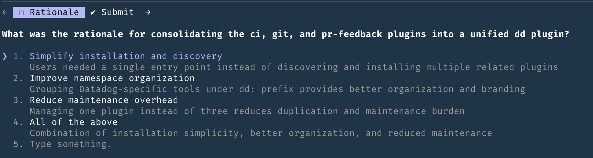

# DataDog Plugin Commands

This document describes all available commands in the DataDog Claude plugin, organized by category.

---

## CI Commands

Analyze and fix continuous integration failures across GitHub Actions and GitLab CI.

### Prerequisites

- `gh` (GitHub CLI) for checking CI status and GitHub Actions
- `ddtool` (Datadog internal tool) for GitLab CI log access via DDCI API
- `dd-auth` (optional) for CI Visibility API access to historical data

### `/dd:ci:fix`

**Description:** Automatically analyze CI failures and propose fixes for both GitLab CI and GitHub Actions.

**Usage:**
```bash
/dd:ci:fix
```

**Workflow:**

1. **Check CI Status** - Fetches the status of all CI jobs for the current PR/branch
2. **Fetch Logs** - Retrieves logs from failed jobs (prioritizes: build → tests → linting → other)
3. **Analyze Failures** - Provides detailed analysis with:
   - Root cause summary (what failed, why, triggering condition)
   - Affected components (files, systems, dependencies)
   - Proposed fix (concrete code changes with line numbers)
4. **Present Findings** - Shows summary and asks how to proceed:
   - Apply all fixes now
   - Apply fixes one at a time
   - Create a detailed implementation plan only
   - Show more details about a specific failure
5. **Apply Fixes** - Implements changes based on your choice
6. **Verification** - Reminds you to review, test, and push changes

**Features:**
- Supports both GitLab CI and GitHub Actions
- Intelligent job prioritization
- Detailed root cause analysis with evidence from logs
- Interactive fix application
- Confidence levels when uncertain

**Example Output:**
```text
CI Failure Analysis Complete
============================

Found 2 failed job(s):

1. test-unit - GitHub Actions
   Root Cause: Test timeout in AuthServiceTest.testOAuthFlow
   Fix: Increase timeout and mock external API call

2. lint - GitLab CI
   Root Cause: Import ordering violations in auth/oauth.go
   Fix: Run goimports to fix ordering

---

Would you like me to:
a) Apply all fixes now
b) Apply fixes one at a time (I'll ask before each)
c) Create a detailed implementation plan without applying changes
d) Show me more details about a specific failure first
```

### `/dd:ci:status`

**Description:** Check CI status for the current PR/branch without analysis or fix proposals.

**Usage:**
```bash
/dd:ci:status
```

**Features:**
- Quick overview of all CI jobs
- Groups jobs by state (failed, passed, in progress, pending)
- Shows duration for each job
- Identifies CI system (GitLab CI vs GitHub Actions)
- No log fetching or analysis - just status

**Example Output:**
```text
CI Status for PR #1234 (branch: feature/my-feature)
===================================================

❌ FAILED (2)
  • test-unit                    5m 12s    [GitLab CI]
  • test-integration             8m 45s    [GitLab CI]

✓ PASSED (5)
  • build                        2m 34s    [GitLab CI]
  • lint                         45s       [GitHub Actions]
  • typecheck                    1m 20s    [GitHub Actions]

⏳ IN PROGRESS (1)
  • deploy-preview               running 3m...    [GitLab CI]

---
Summary: 2 failed, 5 passed, 1 running
```

**When to Use:**
- Quick check if CI is passing before pushing
- Monitoring CI progress without deep analysis
- Deciding whether to run `/dd:ci:fix` or `/dd:ci:retry`

---

### `/dd:ci:retry`

**Description:** Retry failed CI jobs for the current PR/branch.

**Usage:**
```bash
# Interactive mode - shows failed jobs and asks which to retry
/dd:ci:retry

# Retry a specific job by name
/dd:ci:retry test-unit

# Retry all failed jobs
/dd:ci:retry all
```

**Features:**
- Supports both GitLab CI (via DDCI API) and GitHub Actions
- Interactive job selection when no argument provided
- Can retry individual jobs or all failed jobs at once
- Reports new execution IDs for tracking

**Example Output:**
```text
CI Retry Results
================

✓ test-unit (GitLab CI)
  Retry initiated - new execution ID: 1377714662

✓ lint (GitHub Actions)
  Workflow rerun triggered - run ID: 12345678

---
Retried 2 job(s). Monitor progress with /dd:ci:status or check GitHub PR.
```

**When to Use:**
- Known flaky test failures
- Transient infrastructure issues
- After external dependencies are restored
- When you want to retry without fetching logs or analysis

**Note:** DDCI job retries require VPN connection. GitHub Actions retries require appropriate repository permissions.

---

### Skills: `fetch-ci-results`

This skill is automatically invoked when needed. It fetches CI job status and logs from GitHub Actions or GitLab CI.

**Capabilities:**
- Fetches job status and logs
- Supports both CI platforms
- Includes historical CI data querying via Datadog's CI Visibility API
- Provides platform-specific guides for manual operations

**CI Data Hierarchy:**
- Pipeline (workflow run)
- Job (individual job in workflow)
- Suite (test suite)
- Test (individual test)

### Scripts

**`get_ddci_logs.sh`** - Fetches logs from GitLab CI jobs via DDCI UI API. Uses `ddtool` for authentication. Supports `--summary` flag for CI Visibility error summaries.

**`retry_ddci_job.sh`** - Retries a failed GitLab CI job via DDCI UI API. Auto-discovers request_id from the current PR/commit. Returns new execution ID on success.

**`query_ci_data.sh`** - Queries historical CI data via Datadog's CI Visibility API. Requires `dd-auth` for authentication.

### Error Handling

- **Missing gh command**: Install GitHub CLI
- **Missing ddtool**: Install with `brew install datadog/tap/ddtool`
- **DDCI request not found**: Prompts for request_id (from Mosaic URL)
- **Ambiguous failures**: Command will ask for clarification
- **No clear fix**: Command will explain findings and suggest investigation steps

### Important Guidelines

- **Be Specific**: Analysis includes exact error messages and file/line numbers
- **Show Evidence**: Quotes relevant log lines that led to conclusions
- **Confidence Levels**: Clearly states uncertainty and suggests alternatives
- **Test Impact**: Mentions if changes could affect other parts of the codebase
- **User Control**: Always confirms before making changes unless explicitly told to proceed

---

## Git Commands

Git workflow utilities for intelligent commit management.

### `/dd:git:commit:atomic`

**Description:** Create atomic commits by intelligently grouping related changes into separate, focused commits.

**Usage:**
```bash
# Analyze all changes and create atomic commits
/dd:git:commit:atomic

# Only commit changes related to a specific feature
/dd:git:commit:atomic auth feature

# Specify feature and rationale
/dd:git:commit:atomic auth feature Added OAuth support for third-party login
```

**Features:**
- Automatically detects distinct features in your uncommitted changes
- Groups related implementation, tests, and documentation together
- Handles files with mixed changes using `git add -p` for selective staging
- Excludes Claude-generated planning/testing files (unless they're the only changes)
- Generates properly formatted commit messages with:
  - Conventional commit format: `<type>(<scope>): <description>`
  - Bullet points explaining what changed and why
  - Rationale paragraph
- Stops immediately if any git command fails

**Arguments:**
- `[feature-name]` - (Optional) Name of the specific feature to commit
- `[rationale]` - (Optional) Rationale for the change

**Commit Types:**
- `feat` - New features
- `fix` - Bug fixes
- `refactor` - Code restructuring without functionality change
- `docs` - Documentation changes
- `test` - Test additions/modifications
- `chore` - Build, dependencies, generated files
- `style` - Formatting, whitespace
- `perf` - Performance improvements

**Example Output:**
```
feat(auth): Add OAuth2 authentication middleware

- Add OAuth2 provider configuration and client setup
- Implement middleware for token validation and user session creation
- Add error handling for expired and invalid tokens
- Integrate with existing user repository for account lookup

Rationale: Users requested the ability to authenticate using their existing OAuth2 providers (Google, GitHub) instead of creating new credentials. This reduces friction in the onboarding process and improves security by leveraging established identity providers.
```

When the rationale is not clear from context, Claude will ask you to clarify:



**See Also:** [commands/git/commit/atomic.md](./commands/git/commit/atomic.md) for detailed implementation instructions

---

### `/dd:git:commit:quick`

**Description:** Quickly commit all changes with a well-formatted commit message. Optimized for speed while maintaining commit message quality.

**Usage:**
```bash
# Interactive mode (will ask for details if needed)
/dd:git:commit:quick

# Specify type and scope
/dd:git:commit:quick feat commands

# Include rationale
/dd:git:commit:quick feat commands Added fast commit workflow
```

**Features:**
- Commits all changes in a single commit (uses `git add -A`)
- Fast analysis using the Haiku model
- Maintains conventional commit format with bullets and rationale
- Stops immediately if any git command fails

**Arguments:**
- `[type]` - (Optional) Commit type (feat, fix, refactor, docs, test, chore, style, perf)
- `[scope]` - (Optional) Component/module affected
- `[rationale]` - (Optional) Rationale for the change

**When to Use:**
- Quick commits where all changes belong together
- Simple updates that don't need atomic grouping
- When speed is prioritized over detailed analysis

**When to Use Atomic Instead:**
- Changes span multiple distinct features
- Need to selectively stage file hunks
- Want detailed feature-by-feature commit history

**Example Output:**
```
feat(commands): Add quick commit command

- Create streamlined commit workflow for fast commits
- Maintain conventional commit message format
- Include automatic change analysis and staging
- Add support for command arguments to skip prompts

Rationale: Users needed a faster alternative to the atomic commit workflow for simple changes where all modifications should go into a single commit. This reduces the overhead of manual file staging while maintaining commit message quality.
```

**See Also:** [commands/git/commit/quick.md](./commands/git/commit/quick.md) for detailed implementation instructions

---

### Skills: `git-branches`

This skill is **MANDATORY** and automatically invoked before any git diff/log commands. It detects the correct base branch in stacked branch workflows.

Detection hierarchy:
1. Graphite (`gt` CLI)
2. Git Machete (`git-machete` CLI)
3. GitHub PR relationships
4. `rebase.updateRefs` configuration
5. Origin HEAD (main/master fallback)

The skill handles Datadog's common stacked branch patterns.

---

## PR Commands

Fetch and address GitHub pull request review comments.

### Prerequisites

- `gh` (GitHub CLI) must be installed and authenticated
- `jq` must be installed for JSON processing

### `/dd:pr:address-feedback`

**Description:** Address PR feedback from your current branch or a specific PR/comment.

**Usage:**

Address PR feedback from your current branch:
```bash
/dd:pr:address-feedback
```

Or specify a PR number, PR URL, or specific comment URL:
```bash
/dd:pr:address-feedback 12345
/dd:pr:address-feedback https://github.com/DataDog/repo/pull/12345
/dd:pr:address-feedback https://github.com/DataDog/repo/pull/12345#discussion_r2406356483
```

**Workflow:**

The command will:
1. Fetch unresolved, non-outdated comments
2. Create a task plan to address each comment
3. Implement the requested changes
4. Run tests and build if needed

### Skills: `get-pr-feedback`

This skill is automatically invoked when needed. It fetches PR comments programmatically and returns structured JSON containing:
- Comment author, body, path, line numbers
- Diff hunks for context
- Resolution status (resolved/outdated)
- HTML URLs for reference
- Thread information for replies

---

## Command Development

To add a new command to this plugin:

1. Create a new `.md` file in the appropriate directory (e.g., `commands/category/new-command.md`)
2. Add frontmatter with `description` and optional `argument-hint`
3. Write the command instructions
4. Update this document with the command documentation
5. Increment the plugin version in `.claude-plugin/plugin.json`

**Template:**
```markdown
---
argument-hint: [optional-arg]
description: Short description of what the command does
---

# Command Name

Detailed instructions for Claude to follow when executing this command...
```

---

## Contributing

Found a bug or have a suggestion? Post in the [#claude](https://dd.enterprise.slack.com/archives/C08JV0E6XGW) channel on Slack.
